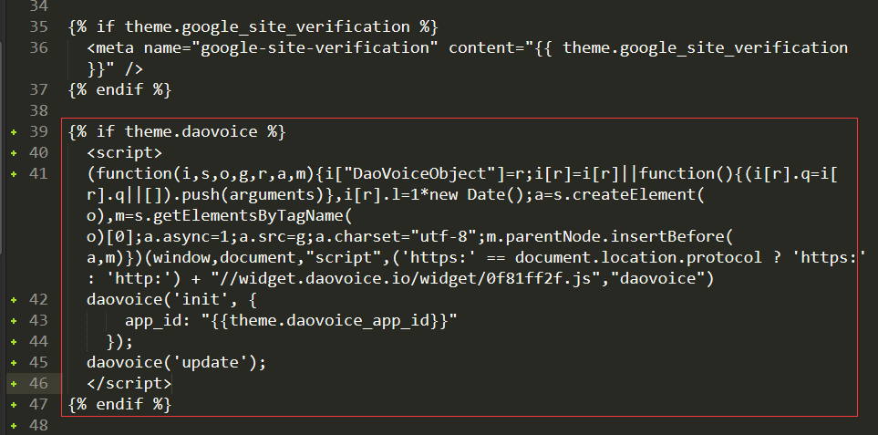
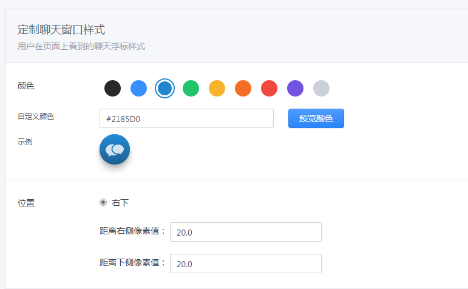

访问别人博客的过程中发现别人的博客有聊天功能，看着挺不错。研究了下，给自己的博客页也加上类似的功能，特此记录。   

<!--more-->

#  注册  

首先需要去[DaoVoice](https://account.daocloud.io/signup)注册账号，注册[邀请链接](http://dashboard.daovoice.io/get-started?invite_code=53d635ce)  

  

完成后，会得到一个`app_id`，后面会用到：  

 ```
daovoice('init', {
  app_id: "***"
});
daovoice('update');
 ```

保存好这个id值，后面会用到。  

#  修改head.swig  

修改`/themes/next/layout/_partials/head.swig`文件，添加内容如下：  

`````` 

  <script>
  (function(i,s,o,g,r,a,m){i["DaoVoiceObject"]=r;i[r]=i[r]||function(){(i[r].q=i[r].q||[]).push(arguments)},i[r].l=1*new Date();a=s.createElement(o),m=s.getElementsByTagName(o)[0];a.async=1;a.src=g;a.charset="utf-8";m.parentNode.insertBefore(a,m)})(window,document,"script",('https:' == document.location.protocol ? 'https:' : 'http:') + "//widget.daovoice.io/widget/0f81ff2f.js","daovoice")
  daovoice('init', {
      app_id: "{{theme.daovoice_app_id}}"
    });
  daovoice('update');
  </script>

``````

  

#  配置主题文件  

在`_config.yml`文件中添加内容：    

```
# Online contact
daovoice: true
daovoice_app_id:   # 这里填你刚才获得的 app_id
```

基本上大功告成了，之后hexo命令重新生成发布即可。如果需要进行聊天窗口配置的话，也可以在浏览器中登录daoVoice后在控制面板中配置。  

  

有什么问题的话欢迎留言哦 ！