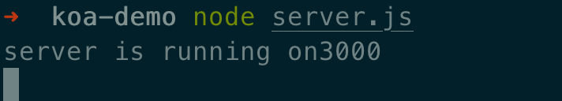
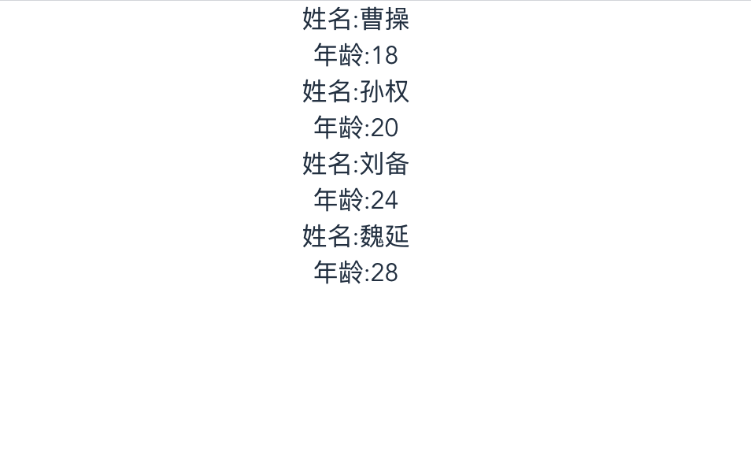

前段时间写了一篇[前端vue项目实现mock数据方式](https://rocky-191.github.io/2020/05/05/vue-mock-demo/)的文章，主要是在vue项目里使用mock数据，数据和项目耦合在一起，不太优雅，作为一个有追求的前端，怎么能容忍这种方法呢？特以此篇，记录利用koa2搭建服务端，提供mock数据的方法。

<!--more-->

## 初始化vue项目
这里以vue项目为主，当然别的类型项目依然可以使用这种mock数据的方式。

```
vue create vue-koa2-demo
```
前提是安装了vue-cli的脚手架，我电脑安装的是vue-cli3的版本。按照要求一步一步选择后，记得选择安装vuex，后续要使用，启动项目。

## koa2项目初始化
前端项目弄好之后，开始安装koa

```
mkdir koa-demo
cd koa-demo
npm koa koa-router koa-cors
```
安装工作完成后，在项目根目录下新建一个server.js.

```
let Koa=require('koa')
let Router=require('koa-router')
let cors=require('koa-cors')
let fs=require('fs')

const app=new Koa()
const router=new Router()

router.get('/getData',async ctx=>{
  // 允许cors跨域请求
  await cors();
  // 返回数据
  ctx.body=JSON.parse(fs.readFileSync('./static/data.json'));
})

// 将koa和中间件连起来
app.use(router.routes()).use(router.allowedMethods());

let port=3000;
app.listen(port,()=>{
  console.log('server is running on'+port)
})

```
上面请求了一个data.json。需要在项目根目录下新建文件夹static，新建data.json

```
[{
  "id": 1,
  "name": "曹操",
  "age": "18"
}, {
  "id": 2,
  "name": "孙权",
  "age": "20"
}, {
  "id": 3,
  "name": "刘备",
  "age": "24"
}, {
  "id": 4,
  "name": "魏延",
  "age": "28"
}]
```
在终端中执行命令启动koa项目

```
node server.js
```
当看到下图时，表示启动项目成功


## 改造前端项目

* 修改Home.vue文件

```
<template>
  <div class="home">
    <ul>
      <li v-for="item in list" :key="item.id">
        <p>姓名:{{ item.name }}</p>
        <p>年龄:{{ item.age }}</p>
      </li>
    </ul>
  </div>
</template>

<script>
export default {
  name: "Home",
  computed: {
    list() {
      return this.$store.state.list;
    }
  },
  mounted() {
    this.getlist();
  },
  methods: {
    getlist() {
      this.$store.dispatch('getData')
    }
  }
};
</script>


```

* 修改App.vue文件

```
<template>
  <div id="app">
    <router-view />
  </div>
</template>
```

* 修改store/index.js
```
import Vue from "vue";
import Vuex from "vuex";
import axios from "axios";

Vue.use(Vuex);

export default new Vuex.Store({
  state: {
    list: []
  },
  mutations: {
    setlist(state, data) {
      state.list = data;
    }
  },
  actions: {
    getData({ commit }) {
      axios
        .get("/api/getData", {
          headers: {
            Accept: "application/json",
            "Content-Type": "application/json"
          }
        })
        .then(res => {
          if (res.status === 200) {
            return res.data;
          }
        })
        .then(res => {
          commit("setlist", Array.from(res));
        });
    }
  },
  modules: {}
});

```
记得提前安装axios，这里需要使用axios请求后端接口。

* 新建配置文件  
在根目录下新建一个vue.config.js，由于前后端项目存在跨域，需要使用代理实现。

```
module.exports = {
  devServer: {
    port: 8085, // 端口号
    https: false, // https:{type:Boolean}
    open: true, //配置自动启动浏览器
    proxy: {
      "/api": {
        target: "http://127.0.0.1:3000",
        changeOrigin: true,
        pathRewrite: {
          "^/api": "/"
        }
      }
    }
  }
};
```
重新启动项目
```
npm run serve
```
就会看到页面上显示出了koa-demo项目里定义的json数据了，大功告成。



这样以后就可以将mock数据的项目和具体前端项目分离开，更方便的使用。再也不用求着后端给mock数据了，自己搞！

## 参考资料

* [koa官网](https://koa.bootcss.com/)